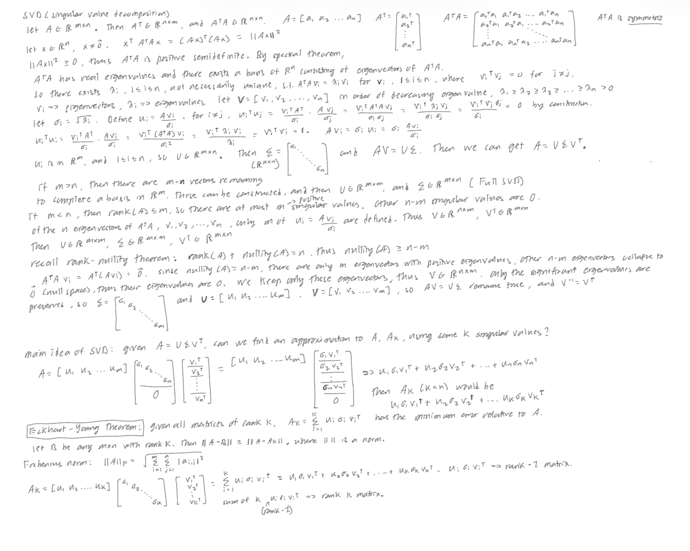

# SVD-project
The goal of this project is to reconstruct a grayscale image using singular value decomposition. I will elaborate on the math first, and then analyze the results. 
Let $A$ be a matrix in R^(m x n) representing our test image. Each entry represents the color grade of a pixel in the image. 255 corresponds to white, and 0 corresponds to black. Values in between are different shades of gray. Our goal is to reconstruct our test image as closely as possible using a low rank approximation of $A$. 
First let us derive the SVD formula, which is $A= (U)(\Sigma)(V^T)$, where $V$ is R^(n x n), $\Sigma$ is R^(m x n), and $U$ is R^(m x m). Consider $A^TA$, which is n x n. The image shows that $A^TA$ is symmetric and postive semidefinite. Using the spectral theorem, we can conclude that $A^TA$ has real eigenvalues and there exists a basis of R^n consisting of eigenvectors of $A^TA$. This means that there exists $V= (v_1, v_2,...,v_n)$ such that $v_i$ are eigenvectors of $A^TA$ and comprise of a basis of R^n, meaning that they are orthonormal. What we want to do is to find unit vectors, $u_i$, in R^m, and singular values ($\sigma) such that $A(v_i)= (\sigma_i)(u_i)$. Note that $u_i$ is in R^m, so effectively we want to describe the linear transformation $A: R^n -> R^m$ using the new basis $U=(u_1,u_2,...,u_m)$ and the "stretch" factors $\sigma_i$. Let $\lambda_i$ be the eigenvalues of $A$, meaning that $A^TAv_i = \lambda_i v_i$ . Let $\sigma_1 \geq \sigma_2 \geq \cdots \geq \sigma_n \geq 0$. Note that because of the eigenvalues are nonnegative, so are the singular values. It is easy to show that $u_i$ are orthogonal. Note that it is possible for some of the eigenvalues to be zero, which would mean there is no corresponding $u_i$ for these eigenvalues. For now, let us assume that all the n eigenvalues are nonzero. Then we can write the equality $(A)(V)= (U)(\Sigma)$, where $U$ is m x n, and $\Sigma$ is an n x n diagonal matrix with singular values on the diagonal in descending order $\sigma_1 \geq \sigma_2 \geq \cdots \geq \sigma_n \geq 0$. Note that if m is greater than n, the column space of $U$ is a subspace of R^m. We can constuct another (m-n) orthogonal vectors, but then $\Sigma$ changes shape, becoming m x n, with still n singular values on the diagonal and zeros underneath. This effectively cancels the (m-n) orthogonal vectors we computed, making it slightly inefficient. This is called the full SVD, which we use in the code. Finally, we can right-mutliply by $V^-$, which is the same as $V^T$ for orthogonal matrices, to get $A= (U)(\Sigma)(V^T)$. The dimenesions change if we have m<n. Then $\text{rank}{A} \leq m$. Using the rank-nullity theorem, $\text{rank}{A} + \text{nullity}{A}= n$, we can conclude that $\text{nullity}(A) \geq n - m$. Thus there are at most m eigenvectors with positive eigenvalues, which are the only ones we care about. So $V$ becomes n x m, and $U, \Sigma$ are both m x m, with $\Sigma$ being a diagonal matrix with $\sigma_i$ on the diagonal. Our example image is 530x350, m > n, so we use the first derived formula. Recall that we made the assumption that all n eigenvalues are nonzero, this is often not the case, so the dimensions adjust accordingly if we have r < n positive eigenvalues. 
The goal of SVD in image compression is the following: get the best low rank approximation to $A$. This means instead of using all the n singular values, we just use the top k (k < n), which are the k largest singular values. Having the singular values in descending order helps tremendously, since we can just take the first k columns of V, take the upper left k x k block of $\Sigma$, and the first k columns of $U$. The dimensions match (m x n)(n x k) = (m x k)(k x k). By the Eckhart-Young theorem, we know that this approximation to $A$, $A_k$, is the best approximation to $A$. We use a norm (|| ||) to quantify the error, in this case the Frobenius norm, which is written in the image below. It is essentially the sum of the sqauared values of the difference matrix under the square root, or the "length" of the difference matrix. Eckhart-Young states that $||A-B|| >= ||A-A_k||$ where $B$ is any rank-k matrix of size m x n. Looking at the images, we can see that for k=50 to k=200, we can hardly tell the difference in the images. This means that the singular values from k=51 to 200 hardly contribute anything to the image quality. Quantitatively, we can plot the error given by the Frobenius norm using k largest singular values over the compression ratio, which is a ratio of the number stored of values in the reconstructed matrix over the number of stored values in the original matrix. Of course, by taking only k singular values (k < n), we have lesser stored values, so the ratio < 1. We can see that we only need a tenth of the stored values of $A$ in order to get an error norm under 0.1, and then after 0.1 the error decreases at a slower rate. This supports our hypothesis that some singular values do not contribute much to $A$. We can further support this hypothesis by looking at the plot of cumulative energy vs k. Cumulative energy is defined as the sum of the sqaured k largest singular values over the sum of all the squared singular values. We can see that at k=20, we have a cumulative energy of 99%, and from k=50 to 200, the cumulative energy approaches a asymptote near the 100% value. This again means that despite having 350 singular values, at least 150 of them can be discarded as they do not provide any new information. However, looking at our test image, we can see that there is a noticeable difference in quality between k=20 and k=50. Finally, we can just plot the singular values over their index k, recalling that they are in nonincreasing order. We can see that the singular values less than 100 ($10^2$), are the ones who have minimal contribution to the image.   

